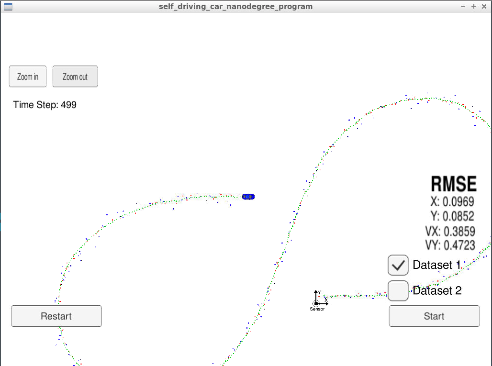

# Self-Driving Car Engineer Nanodegree Program

## Project : Extended Kalman Filter Project
### Term : 1, Project : 5

In this project you we utilize a kalman filter to estimate the state of a moving object of interest with noisy lidar and radar measurements.

### Important Links :
* [Term 2 Simulator](https://github.com/udacity/self-driving-car-sim/releases)
* [Windows 10 Bash on Ubuntu](https://www.howtogeek.com/249966/how-to-install-and-use-the-linux-bash-shell-on-windows-10/) to install uWebSocketIO.
* [Google's C++ style guide](https://google.github.io/styleguide/cppguide.html).
* For [generating additional data](https://github.com/udacity/CarND-Mercedes-SF-Utilities)
* [Project Ribric](https://review.udacity.com/#!/rubrics/748/view)

### Build Instructions, to run this on local machine
Once the install for uWebSocketIO is complete, the main program can be built and run by doing the following from the project top directory.

1. mkdir build
2. cd build
3. cmake ..
4. make
5. ./ExtendedKF

INPUT: values provided by the simulator to the c++ program

["sensor_measurement"] => the measurement that the simulator observed (either lidar or radar)

OUTPUT: values provided by the c++ program to the simulator

["estimate_x"] <= kalman filter estimated position x

["estimate_y"] <= kalman filter estimated position y

["rmse_x"]

["rmse_y"]

["rmse_vx"]

["rmse_vy"]

---

## Other Important Dependencies

* cmake >= 3.5
  * All OSes: [click here for installation instructions](https://cmake.org/install/)
* make >= 4.1 (Linux, Mac), 3.81 (Windows)
  * Linux: make is installed by default on most Linux distros
  * Mac: [install Xcode command line tools to get make](https://developer.apple.com/xcode/features/)
  * Windows: [Click here for installation instructions](http://gnuwin32.sourceforge.net/packages/make.htm)
* gcc/g++ >= 5.4
  * Linux: gcc / g++ is installed by default on most Linux distros
  * Mac: same deal as make - [install Xcode command line tools](https://developer.apple.com/xcode/features/)
  * Windows: recommend using [MinGW](http://www.mingw.org/)

